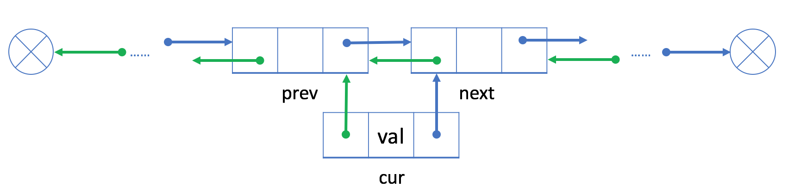
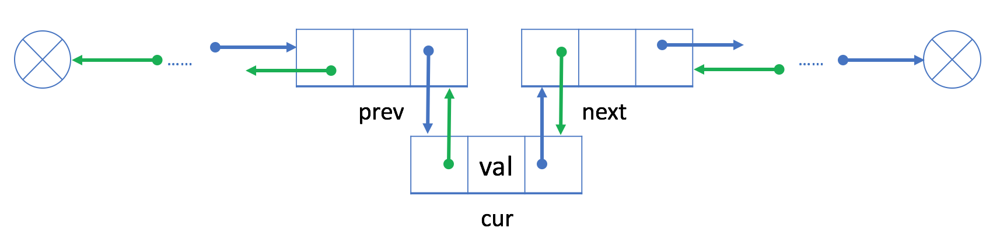
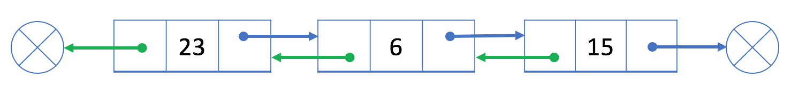
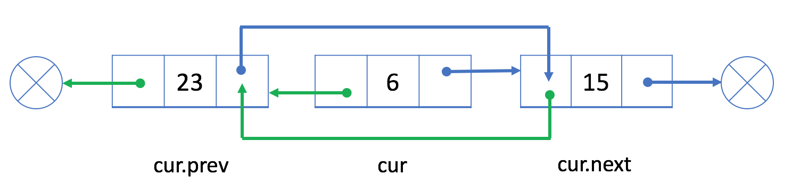

# 链表乘法

## 实验内容

编程设计一个链表用来储存多项式,并写一个函数实现多项式乘法。

## 示例

 **输入**：

- 2X^3+4
- 4X^4+2X^3

 **输出**：

- 8X^7+4X^6+16X^4+8X^3

 **解释**：

```cpp
A(X)=2X^3+4
B(x)=4X^4+2X^3
C(X)=A(x)*B(x)=8X^7+4X^6+16X^4+8X^3
```

## 解题思路

> 需求分析：  首先需要构建一个链表用来储存这个多项式。分析知: 多项式分为系数部分和指数部分，还应该记录链表的长度`size`为了方便计算节点添加的位置。 因此链表的节
点需要储存单项的系数和指数。 这里用具有头尾指针的双链表，方便添加/删除 。

链表的四种基本操作： 增，删，查，改 。

如果我们想在现有的结点 prev 之后插入一个新的结点 cur，我们可以将此过程分为两个步骤：

  1. 链接 `cur` 与 `prev` 和 `next`，其中 `next` 是 prev` 原始的下一个节点；

  

  2. 用 `cur` 重新链接 `prev` 和 `next`。
  

如果我们想从双链表中删除一个现有的结点 cur，我们可以简单地将它的前一个结点 prev 与下一个结点 next 链接起来。

  1. 我们的目标是从双链表中删除结点 6。

  
  2. 我们将它的前一个结点 23 和下一个结点 15 链接起来：
  

### 增 && 改

需求 : 传入参数为系数和指数，无返回值。本体当中查和改是同步进行的， 如果新节点能自动在链表中找好位置加入，就省去了链表排序的步骤。

- `void auto_add(float coef_, float ex_)`

```cpp
{
Node *cur = head;
        if (!head)
        {
            addAtHead(coef_, ex_);
            return;
        }
        if (ex_ < head->ex)
        {
            addAtHead(coef_, ex_);
            return;
        }
        if (ex_ > tail->ex)
        {
            addAtTail(coef_, ex_);
            return;
        }
        for (int i = 0; i < size; i++)
        {
            if (cur->ex == ex_)
            {
                cur->coef += coef_;
                return;
            }
            else if (cur->ex < ex_ && ex_ < cur->next->ex)
            {
                addAtIndex(i + 1, coef_, ex_);
                return;
            }
            cur = cur->next;
        }

        return;
}
```

- `void addAtHead(float coef_, float ex_)`

```cpp
{
    Node *tmp = new Node(coef_, ex_);
            if (!head)
            {
                head = tmp;
                tail = tmp;
                size++;
                return;
            }
            tmp->next = head;
            head->pre = tmp;
            head = tmp;
            size++;
            return;
}
```

- `void addAtTail(float coef_, float ex_)`

```cpp
{
        Node *tmp = new Node(coef_, ex_);
        if (!head)
        {
            head = tmp;
            tail = tmp;
            size++;
            return;
        }
        tail->next = tmp;
        tmp->pre = tail;
        tail = tmp;
        size++;
        return;
    }
```

### 删

需求： 当前节点系数是0的时候，删除节点，传入的数据类型是节点指针，无返回值。

- `void delete_byNode(Node *cur_)`

```cpp
  {
        if (cur_ == head)
        {
            Node *tmp = head;
            head = head->next;
            // delete tmp;
            size--;
            return;
        }
        else if (cur_ == tail)
        {
            tail = tail->pre;
            tail->next = NULL;
            size--;
            return;
        }
        Node *tmp = cur_->pre;
        tmp->next = cur_->next;
        cur_->next->pre = tmp;
        // delete cur;
        size--;
        return;
    }
```

### 查

需求： 在本题当中，就是要把链表储存的多项式相乘后的结果可视化输出。

- `void print_self()`

```cpp
{
        Node *cur = head;
        if (!head)
            cout << "empty" << endl;
        else
        {
            cout << "\nThe list is: ";
        }

        for (int i = 0; i < size; i++)
        {
            if (cur->coef == 0)
                continue;
            if (cur->coef != 1)
                cout << cur->coef;
            if (cur->ex != 0)
            {
                cout << "x";
                if (cur->ex != 1)
                    cout << '^' << cur->ex;
            }
            if (cur->ex == 0 && cur->coef == 1)
                cout << cur->coef;

            if (i != size - 1)
                cout << " + ";
            cur = cur->next;
        }
        cout << endl;
    }
```

### 辅助函数

- `void multiply_MyList(MyLinkedList &aim, MyLinkedList &a, MyLinkedList &b)`
  - 将 a, b 两个链表相乘之后的结果用 aim链表保存，增&&删&&改的步骤在aim中进行。
- `void initialize_list(MyLinkedList &a, vector<string> &args)`
  - 将终端输入的 字符串 指令转换成链表的基本操作 （这里全部转换成`auto_add`）


### 完整版

```cpp
#include <iostream>
#include <time.h>
#include <vector>
#include <string>
using namespace std;

class MyLinkedList
{
  private:
    struct Node
    {
        float coef;
        float ex = 0;
        Node *next;
        Node *pre;
        Node(float coef_ = 0, float ex_ = 0)
        {
            coef = coef_;
            ex = ex_;
            next = NULL;
            pre = NULL;
        }
    };

  public:
    /** Initialize your data structure here. */
    Node *head;
    Node *tail;
    int size = 0;

    MyLinkedList()
    {
        this->head = NULL;
        this->tail = NULL;
    }

    /** Get the coefue of the index-th node in the linked list. If the index is incoefid, return -1. */
    int get(int index)
    {
        if (index >= size || index < 0)
            return -1;
        if (!head)
            return -1;
        Node *cur = head;
        for (int i = 0; i < index; i++)
        {
            cur = cur->next;
        }

        return cur->ex;
    }
    /* Get the coef of the ex_, but return -INT64_MAX if the ex_ not exist*/
    int get_byEx(float ex_)
    {
        Node *cur = head;
        for (int i = 0; i < size; i++)
        {
            if (cur->ex == ex_)
                return cur->coef;
            cur = cur->next;
        }
        return -INT64_MAX; //IF ex not exist;
    }

    /** Add a node of coefue coef before the first element of the linked list. After the insertion, the new node will be the first node of the linked list. */
    void addAtHead(float coef_, float ex_)
    {
        Node *tmp = new Node(coef_, ex_);
        if (!head)
        {
            head = tmp;
            tail = tmp;
            size++;
            return;
        }
        tmp->next = head;
        head->pre = tmp;
        head = tmp;
        size++;
        return;
    }

    /** Append a node of coefue coef to the last element of the linked list. */
    void addAtTail(float coef_, float ex_)
    {
        Node *tmp = new Node(coef_, ex_);
        if (!head)
        {
            head = tmp;
            tail = tmp;
            size++;
            return;
        }
        tail->next = tmp;
        tmp->pre = tail;
        tail = tmp;
        size++;
        return;
    }

    /** Add a node of coefue coef before the index-th node in the linked list. If index equals to the length of linked list, the node will be appended to the end of linked list. If index is greater than the length, the node will not be inserted. */
    void addAtIndex(int index, float coef_, float ex_)
    {
        if (index > size || index < 0)
            return;
        if (index == size)
        {
            addAtTail(coef_, ex_);
            return;
        }
        if (index == 0)
        {
            addAtHead(coef_, ex_);
            return;
        }
        Node *newNode = new Node(coef_, ex_);
        Node *cur = head;
        for (int i = 0; i < index - 1; i++)
        {
            cur = cur->next;
            //The newNode should be inserted after cur;
        }
        newNode->next = cur->next;
        newNode->pre = cur;
        newNode->next->pre = newNode;
        cur->next = newNode;
        size++;
        return;
    }

    /** Delete the index-th node in the linked list, if the index is coefid. */
    void deleteAtIndex(int index)
    {
        if (index >= size || index < 0)
            return;
        if (index == 0)
        {
            Node *tmp = head;
            head = head->next;
            // delete tmp;
            size--;
            return;
        }
        if (index == size - 1)
        {
            tail = tail->pre;
            tail->next = NULL;
            size--;
            return;
        }
        Node *cur = head;
        for (int i = 0; i < index; i++)
        {
            cur = cur->next;
            //The node to be deleted should be cur;
        }
        Node *tmp = cur->pre;
        tmp->next = cur->next;
        cur->next->pre = tmp;
        // delete cur;
        size--;
        return;
    }
    void delete_byNode(Node *cur_)
    {
        if (cur_ == head)
        {
            Node *tmp = head;
            head = head->next;
            // delete tmp;
            size--;
            return;
        }
        else if (cur_ == tail)
        {
            tail = tail->pre;
            tail->next = NULL;
            size--;
            return;
        }
        Node *tmp = cur_->pre;
        tmp->next = cur_->next;
        cur_->next->pre = tmp;
        // delete cur;
        size--;
        return;
    }
    void delete_byExp(float ex_)
    {
        Node *cur = head;
        for (int i = 0; i < size; i++)
        {
            if (cur->ex == ex_)
            {
                delete_byNode(cur);
                return;
            }
            cur = cur->next;
        }
    }
    /*!!!! core function !!!!*/
    void auto_add(float coef_, float ex_)
    {
        Node *cur = head;
        if (!head)
        {
            addAtHead(coef_, ex_);
            return;
        }
        if (ex_ < head->ex)
        {
            addAtHead(coef_, ex_);
            return;
        }
        if (ex_ > tail->ex)
        {
            addAtTail(coef_, ex_);
            return;
        }
        for (int i = 0; i < size; i++)
        {
            if (cur->ex == ex_)
            {
                cur->coef += coef_;
                return;
            }
            else if (cur->ex < ex_ && ex_ < cur->next->ex)
            {
                addAtIndex(i + 1, coef_, ex_);
                return;
            }
            cur = cur->next;
        }

        return;
    }
    void print_self()
    {
        Node *cur = head;
        if (!head)
            cout << "empty" << endl;
        else
        {
            cout << "\nThe list is: ";
        }

        for (int i = 0; i < size; i++)
        {
            if (cur->coef == 0)
                continue;
            if (cur->coef != 1)
                cout << cur->coef;
            if (cur->ex != 0)
            {
                cout << "x";
                if (cur->ex != 1)
                    cout << '^' << cur->ex;
            }
            if (cur->ex == 0 && cur->coef == 1)
                cout << cur->coef;

            if (i != size - 1)
                cout << " + ";
            cur = cur->next;
        }
        cout << endl;
    }
};

/**
 * Your MyLinkedList object will be instantiated and called as such:
 * MyLinkedList obj = new MyLinkedList();
 * int param_1 = obj.get(index);
 * obj.addAtHead(coef);
 * obj.addAtTail(coef);
 * obj.addAtIndex(index,coef);
 * obj.deleteAtIndex(index);
 */

void multiply_MyList(MyLinkedList &aim, MyLinkedList &a, MyLinkedList &b)
{
    auto a_ = a.head;

    for (int i_a = 0; i_a < a.size; i_a++)
    {
        auto b_ = b.head;
        for (int i_b = 0; i_b < b.size; i_b++)
        {
            float coef_aim = a_->coef * b_->coef;
            float ex_aim = a_->ex + b_->ex;
            aim.auto_add(coef_aim, ex_aim);
            b_ = b_->next;
        }
        a_ = a_->next;
    }
}
vector<string> split(string &a, char c)
{
    vector<string> result;
    string tmp = "";
    for (int i = 0; i < a.size(); i++)
    {
        if (a[i] == c)
        {
            result.push_back(tmp);
            tmp = "";
            continue;
        }
        tmp.push_back(a[i]);
    }
    if (tmp != "")
        result.push_back(tmp);
    return result;
}

float *get_params(string &arg)
{
    string coef = "", ex = "";
    float *params = new float(2);
    bool flag = 1;
    for (int i = 0; i < arg.size(); i++)
    {
        if (arg[i] == 'x' || arg[i] == '^')
        {
            flag = 0;
            continue;
        }
        if (flag)
        {
            coef.push_back(arg[i]);
        }
        else
        {
            ex.push_back(arg[i]);
        }
    }
    params[0] = std::atof(coef.c_str());
    params[1] = std::atof(ex.c_str());
    if (coef == "")
        params[0] = 1;
    if (ex == "" && flag==false)
        params[1] = 1;
    return params;
}

void initialize_list(MyLinkedList &a, vector<string> &args)
{
    for (int i = 0; i < args.size(); i++)
    {
        float *params = get_params(args[i]);
        a.auto_add(params[0], params[1]);
    }
}

int main()
{

    vector<string> args_1,args_2;
    MyLinkedList result, p1, p2;
    string ploy_1;
    string ploy_2;
    // Initialize the ploy_1 list
    cin >> ploy_1;
    args_1 = split(ploy_1, '+');
    initialize_list(p1, args_1);
    // p1.print_self();
    //Initialize the ploy_2 list
    cin>>ploy_2;
    args_2 = split(ploy_2,'+');
    initialize_list(p2,args_2);
    // p2.print_self();
    multiply_MyList(result,p1,p2);
    result.print_self();
    return 0;
}
```